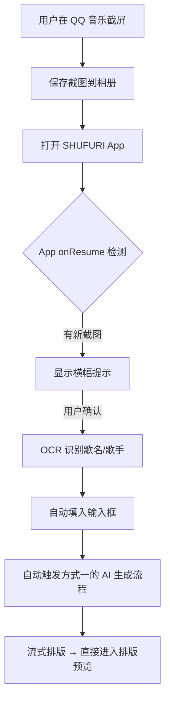

## 用户需求

将 SHUFURI 歌词模块从「生成Prompt → 手动复制 → 跳转粘贴 → 返回粘贴」的繁琐流程，改造为「一键生成 → 云函数代理 → 流式返回 → 自动排版」的无感知流程。采用与 shufulife 项目完全一致的 CloudBase + 腾讯云函数架构，复用现有排版与导出模块，同时支持两种调用方式。

### 方式一：手动输入歌名/歌手

1. 用户在首页填写歌名、歌手名
2. 点击底部的右箭头按钮
3. AI 自动调取歌词、词汇、语法点（如果设置中选择了的话）
4. 在下方的粘贴框中流式生成
5. 完成后提示用户"已完成"，排版预览按键亮起
6. 进入现有的排版导出流程

### 方式二：截屏分享

1. 用户在 QQ 音乐播放页截屏保存图片
2. 打开 SHUFURI
3. 提示"发现音乐分享，要帮你搜索歌词吗"
4. 点击确认后，自动识别填入歌名、歌手名
5. 自动开启 AI 流程 → 流式排版
6. 直接进入排版预览

### 技术约束

- 云函数复用已有的 `arkProxy`，不新建
- CloudBase 环境 ID：`shufu-life-d8g9j8v5385543c1a`
- API Key 必须存在云函数环境变量，前端零暴露
- 排版引擎（`furiganaLayout/`）零改动
- 导出模块（`pdfExport.ts`）零改动
- 输出格式与原流程完全一致（Shufu-Structured-Text）
- 必须支持 SSE 流式响应
- 方式二需要 iOS 相册权限（`NSPhotoLibraryUsageDescription`）

## 技术栈

### 前端 SDK

- `@cloudbase/js-sdk` — CloudBase JS SDK v3，与 shufulife 完全一致
- 环境 ID：`shufu-life-d8g9j8v5385543c1a`

### 云函数

- 复用已有 `arkProxy`（腾讯云 SCF，无需新建）
- 端点：`https://ark.cn-beijing.volces.com/api/v3`
- 支持 action：`chat`（流式 SSE）、`responses`、`doubanSubjectMeta`
- API Key 来源：`process.env.ARK_API_KEY`（云函数环境变量，不暴露前端）
- CORS 头：`Access-Control-Allow-Origin: *`

### AI 模型

- 火山引擎 `doubao-seed-2-0-mini-260215`（流式 SSE）
- 模型调用通过云函数代理，前端零 Key 暴露

### 状态管理

- 现有 `App.tsx` 的 `Mode` 状态机（`'input' | 'edit' | 'export'`）
- 不引入新状态库

## 架构设计

### 调用链路（与 shufulife 完全一致）

```
前端 (japanese-kana-app)
  → @cloudbase/js-sdk (匿名登录)
  → app.callFunction({ name: 'arkProxy', data: { action, body } })
  → 腾讯云函数 arkProxy
  → 火山引擎 ARK API (API Key 存在 SCF 环境变量，不暴露前端)
```

### 系统架构图

```mermaid
graph TD
    A[用户填写歌名/歌手] --> B[点"一键生成"]
    B --> C[HtmlPasteInput 调用 fetchLyricsNotesFromVolcengine]
    C --> D[volcanoChat.sendChatMessageStream]
    D --> E[arkProxy.ts → callArkProxy]
    E --> F[cloudbase.js-sdk → app.callFunction]
    F --> G[腾讯云函数 arkProxy]
    G --> H[火山引擎 ARK API SSE 流式]
    H --> I[前端 onChunk 回调实时更新]
    I --> J[解析 AI 输出为 Structured Text]
    J --> K[preparePasteForLayout → bodyHtml]
    K --> L[onLayout → 进入排版预览]
    L --> M[现有编辑/导出流程不变]
```

### 方式二调用链路



## 实现方案

### 步骤一：安装 CloudBase JS SDK

```
npm install @cloudbase/js-sdk
```

### 步骤二：新建 `src/services/cloudbase.ts`

与 shufulife 完全一致：

```typescript
/**
 * CloudBase 配置
 * 环境 ID: shufu-life-d8g9j8v5385543c1a
 */
import cloudbase from '@cloudbase/js-sdk';

export const app = cloudbase.init({
  env: 'shufu-life-d8g9j8v5385543c1a',
});

export default app;
```

### 步骤三：新建 `src/services/cloudbaseAuth.ts`

实现 CloudBase 匿名登录（与 shufulife 完全一致）：

```typescript
import app from './cloudbase';

let authPromise: Promise<boolean> | null = null;

export async function ensureCloudbaseAuth(): Promise<boolean> {
  if (authPromise) return authPromise;
  
  authPromise = (async () => {
    try {
      const auth = app.auth();
      // 已有登录态则直接返回
      if (auth.hasLoginState()) return true;
      // 匿名登录
      await auth.signInAnonymously();
      const state = await auth.getLoginState();
      return !!state;
    } catch (e) {
      console.error('[cloudbase-auth]', e);
      return false;
    }
  })();
  
  return authPromise;
}
```

### 步骤四：新建 `src/services/arkProxy.ts`

封装云函数调用，含匿名登录校验（与 shufulife 完全一致）：

```typescript
import app from './cloudbase';
import { ensureCloudbaseAuth } from './cloudbaseAuth';

/**
 * 调用 ARK 代理云函数
 */
export async function callArkProxy(
  action: 'chat' | 'responses',
  body: unknown
): Promise<{ statusCode: number; body: string }> {
  const authOk = await ensureCloudbaseAuth();
  if (!authOk) {
    throw new Error('CloudBase 匿名登录未成功，请在控制台开启「匿名登录」');
  }

  // 调用云函数
  const res = await app.callFunction({
    name: 'arkProxy',
    data: {
      action,
      body,
    },
  });

  if ((res as any).err) {
    throw new Error((res as any).err?.message || '云函数调用失败');
  }

  return res.result as { statusCode: number; body: string };
}
```

### 步骤五：新建 `src/services/volcanoChat.ts`

从 Git 历史 `455dbc0` commit 恢复，改造为通过 `callArkProxy` 调用（不再直连火山引擎）。

核心函数：`sendChatMessageStream(messages, options?, onChunk?)` — SSE 流式解析，通过 `onChunk` 回调实时更新 UI。

改造要点：

1. 原来直连 `https://ark.cn-beijing.volces.com/api/v3/chat/completions`
2. 现改为调用 `callArkProxy('chat', body)` 拿到云函数返回
3. 云函数返回 `stream: true` 的 SSE 响应，前端需解析 `data: {...}` 事件
4. 提取 `choices[0].delta.content` 累积为完整内容

### 步骤六：新建 `src/services/volcengineLyricsNotes.ts`

从 Git 历史 `455dbc0` commit 恢复，调用 `volcanoChat.sendChatMessageStream()` 生成歌词笔记。

关键函数：`fetchLyricsNotesFromVolcengine(rawText, onChunk?, options?)`

### 步骤七：改造 `src/components/HtmlPasteInput.tsx`

**删除**以下按钮和逻辑：

- "一键生成指令"按钮（`handleCopyPrompt` 及相关 state：`copyHint`）
- "一键粘贴"按钮（`handlePasteFromClipboard`）

**新增**以下按钮和逻辑：

- "一键生成"按钮（右箭头图标）：调用 `fetchLyricsNotesFromVolcengine()`，流式接收结果
- 生成过程中显示进度（如"正在生成歌词..."通过 `onChunk` 更新）
- 生成完成后自动调用 `onLayout()` 进入排版预览

**保留**以下按钮：

- "一键清除"按钮
- "排版预览"按钮（生成完成后自动触发，也可手动点）

**新增 state**：

- `generating: boolean` — 是否正在生成
- `generateProgress: string` — 生成进度提示

**方式二相关**：暂不在此组件中实现，方式二逻辑在 `App.tsx` 中处理。

### 步骤八：方式二实现（`App.tsx` 扩展）

在 `App.tsx` 中新增：

1. 检测 App 从后台切回（`appState` 变化）
2. 读取相册最新截图（需要 `@capacitor/camera` 或相册插件）
3. 显示横幅提示："发现音乐分享，要帮你搜索歌词吗"
4. 确认后 OCR 识别 → 自动填入 → 触发生成

注意：方式二需要 iOS 相册权限，需在 `capacitor.config.ts` 和 `Info.plist` 中配置。

### 步骤九：流式响应处理

`volcanoChat.ts` 中的 `sendChatMessageStream()` 需要：

1. 通过 `callArkProxy('chat', body)` 调用云函数
2. 云函数返回 SSE 流式响应（云函数需支持流式返回）
3. 前端解析 `data: {...}` 事件，提取 `choices[0].delta.content`
4. 通过 `onChunk?.(delta)` 回调实时更新 UI（显示生成进度）

由于云函数返回的是 SSE 流，需要处理 `text/event-stream` 响应体。

## 错误处理与降级

1. **CloudBase 登录失败**：提示用户检查网络，提供"手动模式"入口
2. **云函数调用失败**：解析错误信息，提示用户
3. **AI 生成失败**：保留用户已填写的歌名/歌手，允许重试
4. **降级方案**：在设置面板中添加"使用手动模式"开关，切回原来的"复制 Prompt→跳转 AI"流程

## 输出格式保证

AI 的 System Prompt（`externalPromptTemplate.ts`）**完全不变**，确保：

- 输出格式为 Shufu-Structured-Text（`===BEGIN===` / `===LYRICS===` / `---PAIR---` 等）
- `preparePasteForLayout()` 能正确解析 AI 输出
- 进入排版预览后的所有流程完全不变

## Agent Extensions

### SubAgent

- **code-explorer**
- Purpose: 探索 shufulife 项目中 `cloudbaseAuth.ts` 的实现细节，确保匿名登录逻辑与现有架构完全一致
- Expected outcome: 获取完整的 `ensureCloudbaseAuth()` 实现代码

### Skill

- **skill-creator**（如需要）
- Purpose: 如果需要创建新的 CloudBase 相关 skill，使用此技能
- Expected outcome: 创建可复用的 CloudBase 集成技能