## 用户需求

将歌词功能的四个交互流程进行 Native 级优化：

1. **Share Extension 直达**：用户在 QQ 音乐/网易云音乐播放页截屏后，通过 iOS Share Sheet（分享到 SHUFURI）直接将截图传送到 App，替代手动保存再打开 App 的流程
2. **本地 OCR 识别**：使用 Apple Vision Framework 对截图进行本地设备端文字提取，准确识别歌名、歌手、专辑、首句歌词等信息，注入 AI Prompt 帮助 AI 精确定位歌曲
3. **Deep Link 跳转 AI App**：点击【复制 Prompt 去获取】后，底部弹出优雅的 Action Sheet，列出用户手机中已安装的 AI 软件（ChatGPT、Kimi、豆包、文心一言、通义千问、DeepSeek），点击直接唤起对应 App 并携带剪贴板内容
4. **返回自动检测剪贴板**：用户在 AI App 复制结构化歌词后切回 SHUFURI，`appStateChange` 生命周期中自动读取剪贴板，正则匹配到 Shufu 结构化格式时弹出居中卡片：「检测到《[歌名]》的歌词数据」+「一键渲染排版」按钮

## 产品概述

### 方式一：手动输入歌名/歌手（现有流程增强）

- 沿用现有「歌名」「歌手」输入框
- 点击【复制 Prompt 去获取】，底部弹出自定义 Action Sheet，列出已安装的 AI App 图标
- 点击 AI App 图标 → 系统跳转唤起对应 App，用户粘贴即可
- 切回 SHUFURI → 自动检测剪贴板 → 弹出确认卡片 → 点击进入排版

### 方式二：截屏分享直达（新增）

- 用户在 QQ 音乐/网易云音乐播放页截屏 → 调起 iOS Share Sheet → 选择 SHUFURI
- Share Extension 接收图片 → 通过 App Group 共享容器传递到主 App
- 主 App 收到 `shufuri://screenshot` URL Scheme 回调
- Vision OCR 本地识别文字 → 提取歌名/歌手/专辑/首句歌词
- 自动填入输入框 → 生成含 OCR Context 的 Prompt
- 用户复制 Prompt → Action Sheet 选 AI App → 唤起 AI App 获取结构化歌词
- 切回自动检测 → 一键渲染排版

## 核心功能

### 1. iOS Share Extension

- 新建 Xcode Target: Share Extension，Bundle ID `com.shufuri.ShareExtension`
- 配置 `NSExtensionActivationSupportsImageWithMaxCount = 1`，只接收单张图片
- Share Extension 从 `NSExtensionContext` 提取图片，生成 JPEG 数据
- 写入 App Group 共享容器（`group.com.shufuri`），保存为 `screenshot_share.jpg`
- 通过 `openURL('shufuri://screenshot')` 唤起主 App
- 30 秒超时自动退出

### 2. Apple Vision Framework OCR

- 新建 Capacitor 自定义插件 `VisionOCRPlugin.swift`
- 接收前端传入的 base64 图片数据
- 使用 `VNRecognizeTextRequest`（`VNRequestTextRecognitionLevel.accurate`，日语+中文+英文）
- 返回识别结果的结构化数据：`rawTexts: string[]`（所有识别文本行）、`songTitle`、`artist`、`album`、`firstLyric`
- 前端 OCR 筛选算法：从原始文本中启发式提取关键信息（识别大字号文本、`《》`格式、`演唱：`前缀、时间戳格式等）

### 3. Deep Link 跳转 AI App

- 新建 Capacitor 自定义插件 `DeepLinkPlugin.swift`
- `checkInstalledApps()` 方法：通过 `UIApplication.shared.canOpenURL()` 检测已安装的 AI App
- 白名单在 Info.plist 的 `LSApplicationQueriesSchemes` 中配置：chatgpt, kimiai, doubao, wenxin, tongyi, deepseek
- 前端渲染自定义 Action Sheet 组件，动态显示已安装的 App，点击唤起

### 4. 自动剪贴板检测卡片

- 使用现有 `App.addListener('appStateChange')` 监听 App 回到前台
- 延迟 500ms 后读取剪贴板（`@capacitor/clipboard`）
- `isStructuredLyricsText()` 正则匹配是否 Shufu 格式
- hash 防重检测（`useRef` 记录上次内容 hash，避免重复弹出）
- 匹配时渲染全屏半透明遮罩 + 居中确认卡片
- 卡片样式：沙色/藏青色极简卡片，显示「检测到《[歌名]》的歌词数据」，附「一键渲染排版」和「取消」按钮

### 5. OCR Context 注入 Prompt

- `buildExternalAiPrompt()` 新增可选 `ocrContext` 参数
- 在 Prompt 的 Header 区域插入 `[Context_Hint]` 区块
- 包含 OCR 识别到的歌名、歌手、专辑、首句歌词
- 帮助 AI 精确定位歌曲，减少幻觉得到错误歌词

### 6. Bundle ID 统一与 App Group

- 主 App Bundle ID 保持 `com.shufuri`，反向更新 `capacitor.config.ts` 的 `appId` 为 `com.shufuri`
- 主 Target 和 Share Extension Target 均启用 App Group
- Group ID: `group.com.shufuri`
- URL Scheme: `shufuri://`

## 技术栈

### 前端

- **架构**：React + TypeScript + Vite
- **原生容器**：Capacitor v8.4.0
- **剪贴板**：`@capacitor/clipboard`
- **App 生命周期**：`@capacitor/app`（`appStateChange` 事件）
- **网络检测**：`@capacitor/network`

### iOS 原生

- **Swift 5.9**（Xcode 15+）
- **Capacitor Plugin API**：`CAPPlugin` + `CAPBridgedPlugin`
- **Vision Framework**：`VNRecognizeTextRequest`（iOS 13+）
- **Share Extension**：`SLComposeServiceViewController`（iOS 原生扩展点）
- **App Groups**：`UserDefaults(suiteName:)` + File Coordinator 共享容器
- **URL Scheme**: `shufuri://`
- **LSApplicationQueriesSchemes**: chatgpt, kimiai, doubao, wenxin, tongyi, deepseek

### 部署目标

- iOS 15.0（当前项目中已有，Share Extension 和 Vision Framework 均满足）

## 实现方案

### 整体架构图

```mermaid
graph TD
    subgraph "iOS 原生层"
        SE[Share Extension] -->|保存截图到| AC[App Group 共享容器]
        AC -->|openURL shufuri://screenshot| APP[主 App]
        APP -->|注册 URL Scheme| WK[WKWebView]
        APP -->|Capacitor Plugin| VP[VisionOCRPlugin]
        APP -->|Capacitor Plugin| DP[DeepLinkPlugin]
        WK -->|appUrlOpen 事件| JS[JavaScript]
        JS -->|callFunction| VP
        JS -->|callFunction| DP
        DP -->|canOpenURL| AI_APPS[ChatGPT/Kimi/豆包]
    end

    subgraph "前端 React 层"
        INPUT[HtmlPasteInput] -->|复制 Prompt| CB[剪贴板]
        INPUT -->|点击跳转| JS_ACTION[DeepLink ActionSheet]
        APP_ACTIVE[App.tsx] -->|appStateChange| CLIP_DETECT[剪贴板检测器]
        CLIP_DETECT -->|isStructuredLyricsText| CARD[确认卡片组件]
        CARD -->|一键渲染| LAYOUT[进入排版预览]
        OCR_INPUT[OCR 预填] -->|填入输入框| INPUT
    end

    subgraph "App Group 数据流"
        SE -->|写入 screenshot_share.jpg| AC
        JS -->|读取文件| AC
    end
```

### 模块划分

**iOS 原生层（6 个文件）**：

1. `ios/App/App/VisionOCRPlugin.swift` — Vision OCR 插件
2. `ios/App/App/VisionOCRPlugin.m` — ObjC 桥接头
3. `ios/App/App/DeepLinkPlugin.swift` — AI App 检测插件
4. `ios/App/App/DeepLinkPlugin.m` — ObjC 桥接头
5. `ios/App/App/AppGroupManager.swift` — App Group 共享容器读写工具
6. `ios/LyricsShareExtension/ShareViewController.swift` — Share Extension 主控制器
7. `ios/LyricsShareExtension/Info.plist` — Share Extension 配置

**前端层（10 个文件）**：

1. `src/bridge/visionOCRPlugin.ts` — [NEW] VisionOCR 插件 TS 类型定义
2. `src/bridge/deepLinkPlugin.ts` — [NEW] DeepLink 插件 TS 类型定义
3. `src/utils/nativeBridge.ts` — [MODIFY] 新增 OCR/DeepLink/ShareExtension 桥接
4. `src/components/HtmlPasteInput.tsx` — [MODIFY] 新增 Action Sheet + OCR 预填
5. `src/components/ClipboardDetectCard.tsx` — [NEW] 剪贴板检测确认卡片
6. `src/components/AiAppActionSheet.tsx` — [NEW] AI App 选择 Action Sheet
7. `src/services/externalPromptTemplate.ts` — [MODIFY] 新增 ocrContext 参数
8. `src/App.tsx` — [MODIFY] 新增剪贴板检测逻辑 + Share Extension 处理
9. `src/App.css` — [MODIFY] 新增卡片/ActionSheet 样式
10. `capacitor.config.ts` — [MODIFY] 新增 URL Scheme 和 App Groups 配置

**iOS 配置层（2 个文件）**：

1. `ios/App/App/Info.plist` — [MODIFY] 新增 URL Scheme/QueriesSchemes/权限
2. `ios/App/App/AppDelegate.swift` — [MODIFY] 处理 URL Scheme 回调

### 关键设计决策

1. **Bundle ID 统一**：保持 Xcode 主 Target `com.shufuri` 不变，反向更新 `capacitor.config.ts` 的 `appId` 为 `com.shufuri`。Share Extension 使用 `com.shufuri.ShareExtension`。App Group 使用 `group.com.shufuri`。
2. **App Group 而非直接回调**：Share Extension 通过 App Group 共享文件容器传递图片，而非依赖内存共享，原因是 iOS Suspension 机制下 Share Extension 和主 App 的不同进程需要持久化通道。
3. **URL Scheme 而非 Universal Link**：Share Extension 在非主 App 进程中无法直接 JS 通信，只能通过 `openURL` 唤起主 App。URL Scheme 比 Universal Link 更适合此场景。
4. **OCR 本地执行**：使用 Apple Vision Framework 在设备端执行，零网络请求，保护用户隐私，且识别速度 <500ms。
5. **剪贴板检测防重**：`useRef` 记录最后一次检测内容的 hash，相同则跳过，避免用户每次 App resume 都弹出卡片。
6. **延迟检测**：`setTimeout(500ms)` 确保用户从 AI App 切回时 UIPasteboard 已经完成系统级同步。
7. **只检测结构化格式**：调用 `isStructuredLyricsText()` 正则匹配，非结构化内容直接忽略。
8. **OCR Context 注入不影响现有流程**：`ocrContext` 为可选参数，不存在时行为完全不变，不影响 `isPasteReadyForLayout()` 等下游函数。
9. **Share Extension 不破坏现有模式**：Share Extension 只在输入层增加路径，编辑/导出/排版引擎零改动。

### 实施注意事项

- `buildExternalAiPrompt()` 的 `ocrContext` 仅改变 Prompt 内容，不影响输出格式解析——下游 `preparePasteForLayout()` 和 `extractMetaFromPaste()` 完全不变
- `isStructuredLyricsText()` 是检测结构化歌词的唯一入口，剪贴板检测和 OCR 流程都依赖它，确保不会误判
- OCR 筛选算法需要提前设计好常见歌曲信息布局模式（歌名居中/加粗、`演唱：XXX` 格式、`《》` 包围歌名）
- Share Extension 的 `ShareViewController.swift` 需要 30 秒超时自动退出，避免用户等待太久

### 性能优化

- Vision OCR 在后台线程执行（`VNRecognizeTextRequest` 默认异步），不阻塞 UI
- 剪贴板检测仅在 App resume 时触发，不轮询
- `isStructuredLyricsText()` 是 O(n) 正则匹配，对数百字符的剪贴板内容几乎无开销
- Action Sheet 组件使用 `React Portal` 渲染，避免影响主布局 reflow
- Share Extension 的图片写入使用内存映射文件，避免大图 OOM

### 降级方案

- Share Extension 不可用时（如用户拒绝权限）：手动输入歌名/歌手流程作为兜底
- OCR 识别率低时：原样显示所有识别文本，允许用户手动修正歌名/歌手
- 无 AI App 安装时：Action Sheet 显示「未检测到 AI 应用」+ 提示去 App Store 下载
- 剪贴板检测失败：保留现有「一键粘贴」按钮作为手动入口

## 设计风格

采用极简主义的沙色/藏青色配色方案，与现有 SHUFURI 应用的日系和风调性保持一致。所有新增 UI 元素（Action Sheet、剪贴板检测卡片）都使用卡片式设计，圆角柔和，阴影轻浅，确保不与现有排版预览的视觉风格冲突。

### 核心页面设计

#### 1. AI App Action Sheet（底部弹出）

从屏幕底部滑入的半透明遮罩 + 卡片面板。

**遮罩层**：全屏半透明黑色（`rgba(0,0,0,0.35)`），点击遮罩区域关闭

**面板**：圆角 16px 白色卡片，底部留 safe area 间距

- 顶部标题：「选择 AI 应用打开」— 藏青色 `#1e293b`，字号 17px 字重 600
- 分隔线：1px `#e2e8f0`
- 列表项：每个 App 占一行，左侧 36x36 圆角图标（用首字母/系统 SF Symbol 代替），中间 App 名称，右侧小箭头
- 底部兜底链接：「复制好了，自己打开」— 灰色 `#94a3b8` 字号 14px
- 底部按钮：「取消」— 居中，字重 500

**动效**：面板从底部 spring 弹出（`transform: translateY(100%) → translateY(0)`，`transition: 0.35s cubic-bezier(0.32, 0.72, 0, 1)`）

#### 2. 剪贴板检测确认卡片（居中弹出）

**遮罩层**：全屏半透明黑色（`rgba(0,0,0,0.4)`），点击遮罩关闭

**卡片**：上下居中，水平居中，圆角 20px

- 背景色：沙色 `#f5f0e8`（浅色模式）/ 藏青色 `#1e293b`（深色模式）
- 内边距 28px
- 标题图标（可选）：一个简约的「文档+对勾」SF Symbol 或 Unicode
- 标题：「检测到《[歌名]》的歌词数据」— 字号 20px 字重 600
- 副标题：「歌手：[歌手名]」— 字号 15px 字重 400，颜色 `#64748b`
- 按钮区域：两个按钮水平排列
- 「取消」— 边框按钮（`border: 1.5px solid #cbd5e1`），圆角 12px
- 「一键渲染排版」— 填满按钮，藏青色背景 `#1e293b`，白色文字，圆角 12px
- 最底部小字：「已自动检测到结构化歌词数据」

**动效**：卡片从屏幕中心 fade-in + scale-up（`opacity: 0 → 1, transform: scale(0.92) → scale(1)`，`transition: 0.3s ease-out`）

#### 3. Share Extension 界面（极简）

仅显示一个居中加载指示器 + 文字「正在发送到 SHUFURI…」，自带进度条或沙漏动画。操作完成后自动关闭。

## Agent Extensions

### SubAgent

- **code-explorer**
- Purpose: 探索 shufulife 项目中 Share Extension 和 Vision OCR 的实现模式，参考其 App Group 配置和插件注册方式，确保与现有架构一致
- Expected outcome: 获取完整的项目配置参考，避免配置遗漏

### Skill

- **skill-creator**
- Purpose: 如果需要创建可复用的 Vision OCR 或 Share Extension 相关的 Agent Skill，使用此技能
- Expected outcome: 创建可复用的 iOS 原生插件开发指南 skill