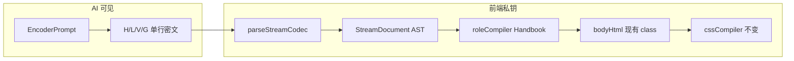
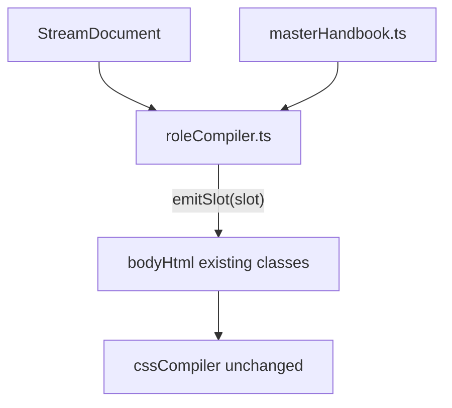
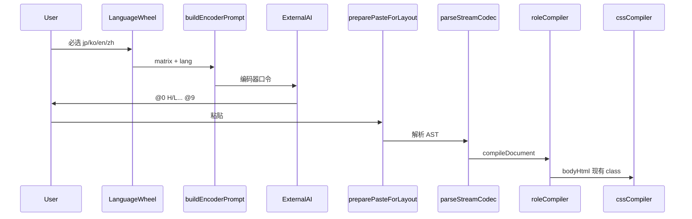

# Prompt 流式密文战略重构计划

## 0. 战略边界（你已确认的原则）

| 层 | 职责 | 对 AI 可见 |
|----|------|------------|
| **Encoder Prompt** | 检索歌词、注音、释义、行号引用 | 仅 H/L/V/G 语法 + `{字:读音}` 微语法 |
| **Stream Codec**（新） | 解析密文 → 语义 AST | 否（私钥） |
| **Role Compiler**（新） | AST → 现有 DOM class HTML | 否（11 角色 + [`tokenRegistry.ts`](src/utils/posterTypography/tokenRegistry.ts) 映射） |
| **Typography/CSS** | 字号/字体/分页 | 否（保持 [`cssCompiler.ts`](src/utils/posterTypography/cssCompiler.ts) 不变） |

**已确认决策**：
- **一次性切换**：移除旧 `===BEGIN===` / `---PAIR---` 解析与口令；不保留 fallback。
- **取消 AUTO**：拨轮与口令仅允许 `jp | ko | en | zh`；OCR/链接只预填歌手歌名并建议语言，不生成 AUTO 口令。

---

## 1. 核心问题与对策



| 宿疾 | 新设计对策 |
|------|------------|
| 多语言规则泄漏（KO 误用日文 HEAD、AUTO 四语同屏） | 四份**完全隔离**的 encoder 模板；口令无 JP/KO/EN/ZH 并列说明 |
| 11 语义角色 AI 不可见 | 角色只存在于 [`roleCompiler.ts`](src/codec/roleCompiler.ts) 映射表，关联 [`POSTER_TEXT_ROLES`](src/utils/posterTypography/tokenRegistry.ts) |
| 长输出截断 | **每条记录单行**；字段定长；完整性靠 `@9` 闭合 + 行数自检指令 |
| 例句幻觉 | V/G 第 5 字段：**纯数字 = 歌词行号引用**；非数字 = 手写例句（仅语法或词未出现时用） |
| 反编译 | 口令无业务词/版本号；Schema 最小化；完整「编译手册」不进 Prompt |

---

## 2. 线缆格式（Wire Format）规范

### 2.1 设计约束：管道符 vs 注音

现有 `{漢\|かな}` 内含 `|`，**不能**直接作为 L/V/G 的分隔符。

**Codec 专用注音微语法（仅 AI 输出层）**：

- 使用 **`{基字:读音}`**（冒号），前端 `normalizeCodecRuby()` 统一转为内部 `{基字|读音}` 再交给 [`applyRubyMarkup`](src/utils/rubyMarkup.ts) / [`applyZhRubyMarkup`](src/utils/zhLayout/zhRubyMarkup.ts)。
- 字段级 `|` 仅作**顶层列分隔**；字段内若需字面 `|`，写 `\|`（Prompt 中一句话说明即可）。

### 2.1.1 列切分实现（采纳 · 硬约束）

**结论：采纳。** 原生 `.split('|')` **禁止**用于顶层列切分——`\|` 会被误切，引发 **Column Shifting**（后续列整体错位，且难以诊断）。

在 [`parseStream.ts`](src/codec/parseStream.ts) 抽取唯一入口 `splitStreamColumns(line)`：

```typescript
/** 仅切分「未被反斜杠修饰」的管道符；切分后再还原字段内字面量 */
export function splitStreamColumns(line: string): string[] {
  return line
    .split(/(?<!\\)\|/)
    .map((col) => col.replace(/\\\|/g, '|'));
}
```

**解析顺序（不可颠倒）**：

1. `trim` 行 → 识别记录前缀（`H/L/V/G/@n`）
2. **`splitStreamColumns`** 得原始列
3. 对含注音的列执行 **`normalizeCodecRuby`**（`{基字:读音}` → `{基字|读音}`）
4. 按记录类型校验**固定列数**（H=4, L=4, V=6, G=6）；列数不对 → 带行号的硬错误

**兼容性**：`(?<!\\)` 负向后行断言在 iOS Safari 16+ / 项目目标 WebView 可接受；若需极老设备兜底，Plan B 为手写状态机扫描（本次不采用，除非 QA 否决）。

**测试必覆盖**（写入 `testStreamCodec.mjs`）：

| 输入片段 | 期望 |
|----------|------|
| `G\|1\|A\|B\|C\|D\|E` | 6 列正常 |
| `L\|1\|含字面量\\|竖线\|gloss` | 第 3 列解析为 `含字面量\|竖线` |
| `V\|1\|term\|mean\|3\|ex` | 第 5 列 `3` 识别为例句行号，非转义 |

**Prompt 侧**：仍鼓励字段内少用手写 `|`；英文释义/标签若含 `|`，口令要求写 `\|`，与解析器行为一致。

### 2.2 记录类型（每条 = 独立一行，无续行）

| 前缀 | 列数 | 列定义 |
|------|------|--------|
| `H` | 4 | `H\|歌手\|歌名\|lang` — lang ∈ `jp\|ko\|en\|zh` |
| `L` | 4 | `L\|行号(1-based)\|目标语注音行\|母语 gloss` — zh 界面可 gloss 留空 |
| `V` | 6 | `V\|序号\|词头注音\|母语释义\|例句域\|例句译` |
| `G` | 6 | `G\|序号\|语法标签\|母语详解\|例句域\|例句译` |

**例句域（V/G 第 5 列）消歧规则（编译器私钥）**：

```typescript
/^\d+$/  → resolveLyricLine(n)   // 1-based，从 L 表取 primary + gloss
else     → inlineExample(text)  // 手写例句，仅当词未出现在任何 L 行时允许
```

语法条：**默认要求行号**；仅当语法点无法对应任一行时才允许手写（Prompt 写死优先级）。

### 2.3 流 envelope（闭合、可分段粘贴）

```
@0
H|山口百惠|秋樱|jp
L|1|{淡:あわ}い{色:いろ}の{秋桜:コスモス}|淡淡的秋樱
L|2|{風:かぜ}に{揺:ゆ}れて|在风中摇曳
...
@1
V|1|{秋桜:コスモス}|秋樱，大波斯菊|3|
V|2|{想:おも}い{出:だ}|回忆|4|
@2
G|1|ば形（假定形）|动词假定形表条件|8|只要在身边就很幸福
@9
```

- `@0`：元数据 + 全部 `L`（**必须先输出完所有 L 再输出 V/G**，保证行号有效）
- `@1`：词汇 `V`（可选；设置关闭词解时可省略整段）
- `@2`：语法 `G`（同上）
- `@9`：**强制闭合**；缺失则解析报错「流未闭合」
- 段标记 `@0/@1/@2` 可省略时由记录前缀推断顺序，但 **@9 不可省略**（便于检测截断）

### 2.4 The Master Handbook — 11 类语义角色一元化映射矩阵（采纳 · 私钥）

**结论：采纳。** 将原 §2.4 表格收拢为 [`masterHandbook.ts`](src/codec/masterHandbook.ts)：**`roleCompiler.ts` 唯一允许的 DOM/角色契约**；[`tokenRegistry.ts`](src/utils/posterTypography/tokenRegistry.ts) 的 `ROLE_SELECTOR_MAP` **不得**在 compiler 中重复维护——compiler 产出的 class 必须与 Handbook 列 `domClass` 一致，cssCompiler 继续按现有选择器渲染（零视觉变更）。

Handbook **对 AI 绝对不可见**；不得出现在 Prompt、错误 toast、日志（prod）。

#### 2.4.1 设计原则

- **一元化**：每条 AST 字段 → 恰好一个 `PosterTextRole`（shell 容器角色除外，见下）
- **强类型**：`satisfies Record<PosterTextRole, HandbookRoleSpec>` + `CodecField → HandbookSlot` 联合类型
- **四语分叉**只在 Handbook 的 `domClass(lang)` 查表，compiler 禁止 `if (lang==='jp')` 散落
- **`pageNumber`** 标记为 `source: 'paginator'`，Stream 不产出；Handbook 仍登记以保持 11 角色完整

#### 2.4.2 类型骨架（计划内契约）

```typescript
// src/codec/masterHandbook.ts
import type { PosterTextRole } from '../utils/posterTypography/tokenRegistry';
import type { LangCode } from '../services/appSettings';

export type MarkupPipeline = 'rubyJp' | 'rubyZh' | 'plainHtml' | 'escapedPlain';

export type HandbookSlot =
  | 'header.artist' | 'header.title' | 'header.lang'
  | 'lyric.index' | 'lyric.primary' | 'lyric.gloss'
  | 'vocab.seq' | 'vocab.term' | 'vocab.meaning' | 'vocab.exampleRef' | 'vocab.exampleTrans'
  | 'grammar.seq' | 'grammar.label' | 'grammar.detail' | 'grammar.exampleRef' | 'grammar.exampleTrans'
  | 'section.vocabTitle' | 'section.grammarTitle';

export interface HandbookRoleSpec {
  role: PosterTextRole;
  /** 哪些 AST 槽位填充此角色 */
  slots: HandbookSlot[];
  source: 'codec' | 'paginator' | 'compilerBuiltin';
  container: 'fv-title-h' | 'lyrics-group' | 'lyrics-vocabulary' | 'lyrics-vocab-item' |
             'lyrics-grammar' | 'lyrics-grammar-item' | 'none';
  domClass: (lang: LangCode) => string;
  markup: MarkupPipeline;
  /** grammar TITLE 括注拆分时 secondary span 的角色 */
  subRole?: PosterTextRole;
  glossGate?: 'always' | 'interfaceNonZh' | 'never'; // zh 管线 L.gloss / exampleTrans
}

export const MASTER_HANDBOOK: Record<PosterTextRole, HandbookRoleSpec>;
```

#### 2.4.3 一元映射矩阵（11 角色 × 全语种 DOM）

| # | PosterTextRole | Codec / 来源槽位 | container | domClass(lang) | markup | 备注 |
|---|----------------|------------------|-----------|----------------|--------|------|
| 1 | `posterTitle` | `header.title` | `fv-title-h` | `.fv-title-name` | `escapedPlain` | 复用 [`buildPosterTitleInnerHtml`](src/utils/shufuriPoster/posterTitle.ts) |
| 2 | `posterArtist` | `header.artist` | `fv-title-h` | `.fv-title-artist` | `escapedPlain` | 同上 |
| 3 | `lyricPrimary` | `lyric.primary` | `lyrics-group` | jp/en→`.jp-line` · ko→`.ko-line` · zh→`.cn-line` | jp→`rubyJp` · zh→`rubyZh` · ko/en→`plainHtml` | 行号仅存 AST，不进 DOM |
| 4 | `lyricSecondary` | `lyric.gloss` | `lyrics-group` | jp/ko→`.zh-line` · en/zh→`.gloss-line` | `escapedPlain` | `glossGate`: zh 且 interface=zh 时可省略整行 |
| 5 | `rubyAnnotation` | （嵌套于 primary/term/example） | — | `ruby rt` | 随父级 pipeline | 不单独 emit 块；Handbook 规定 rt 由 ruby* pipeline 生成 |
| 6 | `sectionTitle` | `compilerBuiltin` | `lyrics-vocabulary` / `lyrics-grammar` | `h2.lyrics-section-title` | `escapedPlain` | 文案私钥：「重点词汇」「重点语法」；**不进 Prompt** |
| 7 | `studyTerm` | `vocab.term` · `grammar.label`（orig 部） | `vocab-line1` / `h3.grammar-point-title` | jp/en→`.vocab-word`/`.grammar-title-ja` · ko→`.vocab-word-ko`/`.grammar-title-ko` · zh→`.vocab-word-cn`/`.grammar-title-cn` | 与 primary 同规则 | label 括注拆分见下行 |
| 7b | `studyAux` | `vocab.meaning` · `grammar.label`（gloss 部） · `grammar.detail` | 同行 / `.grammar-detail` | `.vocab-meaning` · `.grammar-title-gloss` · `.grammar-detail` | `escapedPlain` | 语法 TITLE 括注 → `grammar-title-gloss` |
| 8 | `studyExample` | `resolveExampleRef(vocab\|grammar col5)` | `.vocab-ex-*` / `.grammar-ex-*` | jp/en→`*-ja` · ko→`*-ko` · zh→`*-cn`；副行译→`*-zh` 或 `*-gloss` | 与 term 同 ruby 规则 | col6 → exampleTrans，映射 `studyAux` 或 en 的 gloss 副行 |
| 9 | `grammarPointShell` | `grammar.label` 容器 | `h3.grammar-point-title` | `h3.grammar-point-title` | — | 壳；内嵌 studyTerm + studyAux spans |
| 10 | `studyAux` | `*.exampleTrans` | 例句下方 | `.vocab-ex-zh`/`.grammar-ex-zh` 或 zh 的 `*-gloss` | `escapedPlain` | en 界面 zh 管线用 `.vocab-ex-gloss` |
| 11 | `pageNumber` | `paginator` | `.fv-poster-page-no` | `.fv-poster-page-no` | `escapedPlain` | **非 codec**；[`paginateShufuriPosterHtml`](src/utils/shufuriPoster/paginateShufuriPosterHtml.ts) |

> 注：矩阵中 `studyTerm` / `studyAux` / `studyExample` 各出现多次，Handbook 用 **`slots[]` 数组** 表达「同一排版角色、多 AST 入口」；compiler 通过 `emitSlot(slot, ctx)` 分派，避免重复 HTML 逻辑。

#### 2.4.4 例句域 → 角色编译（私钥逻辑）

```
resolveExampleRef(col5, lines):
  digits → { primary: lines[n-1].primary, gloss: lines[n-1].gloss, cite: 'lyric' }
  else   → { primary: col5, gloss: col6, cite: 'inline' }

emitSlot('vocab.exampleRef'):
  primary → studyExample (domClass per lang)
  gloss   → studyAux on .vocab-ex-zh | .vocab-ex-gloss
```

Handbook 登记 **`exampleTrans` → studyAux** 与 **`exampleRef` → studyExample** 的固定对应，study cards 同步读 AST 同一槽位。

#### 2.4.5 roleCompiler 与 Handbook 关系



- `roleCompiler.ts` **仅**调用 `MASTER_HANDBOOK` + `emitSlot` / `wrapContainer`
- 单元测试 `testMasterHandbook.mjs`：每个 `PosterTextRole` 在 jp/ko/en/zh 四语下 `domClass` 快照；与现 `ROLE_SELECTOR_MAP` **交叉断言一致**
- 长期：`ROLE_SELECTOR_MAP` 可改为从 Handbook 导出（非 MVP 必须，但禁止两处手工双写）

#### 2.4.6 与旧 §2.4 差异

- 从「表格说明」升级为 **可执行 TypeScript 契约文件**
- 明确 `pageNumber` / `sectionTitle` 文案 / `grammarPointShell` 等非 AI 字段归属
- 明确 `rubyAnnotation` 不独立 emit，避免 compiler 漏 rt

[`parseZhStructuredLyrics.ts`](src/utils/zhLayout/parseZhStructuredLyrics.ts) **不再承担**全语种解密；改为：

```typescript
// lyricsHtml.ts 新路由
if (isStreamCodecText(raw)) return compileStreamDocument(parseStreamCodec(raw));
// 删除旧 isStructuredLyricsText 分支
```

zh 管线差异仅在 `roleCompiler` 内：`lang==='zh'` 时 primary 走 `applyZhRubyMarkup`，gloss 规则随 `interfaceLanguage`（是否输出 `.gloss-line`）— **逻辑从现 [`parseZhStructuredLyrics.ts`](src/utils/zhLayout/parseZhStructuredLyrics.ts) 迁入 compiler 的 zh 分支**。

---

## 3. 前端模块划分（新建 `src/codec/`）

```
src/codec/
  types.ts              # StreamDocument, LyricLine, VocabRow, GrammarRow
  detect.ts             # isStreamCodecText: 首行 @0 或 H|；容忍 strip 后判定
  parseStream.ts        # splitStreamColumns(lookbehind) + 按行解析 + @段 + @9 闭合校验
  splitStreamColumns.ts # （可选独立）列切分 + unescape；供 parseStream 与测试复用
  normalizeCodecRuby.ts # {a:b} → {a|b}
  resolveExampleRef.ts  # 数字→L[n]；校验行号范围；非法 index 报错
  roleCompiler.ts       # AST → bodyHtml；**只读** masterHandbook，不写 ad-hoc class
  masterHandbook.ts     # 11 角色一元化映射矩阵（The Master Handbook · 私钥）
  compileDocument.ts    # parse + compile 入口，返回 ParsedStructuredLyrics
  index.ts
```

**删除/废弃**（breaking）：
- [`externalPromptTemplate.ts`](src/services/externalPromptTemplate.ts) 整文件 → 拆为 `src/codec/prompt/`
- [`prompt/zhPromptTemplate.ts`](src/services/prompt/zhPromptTemplate.ts) → `encoderZh.ts`（零多语提及）
- [`structuredLyricsParser.ts`](src/utils/structuredLyricsParser.ts) 中 `parseStructuredLyricsText` / `===` 解析（可删或仅留 header 工具若 study 还需要）
- [`matchLyricCitation.ts`](src/studyCards/matchLyricCitation.ts) 在 codec 路径下 **退役**（行号由 AI 给出；compiler 解析；可选保留单元测试对照）

**改造入口**：
- [`lyricsHtml.preparePasteForLayout`](src/services/lyricsHtml.ts)
- [`cleanDoubaoPaste.ts`](src/utils/cleanDoubaoPaste.ts) — 识别 `@0` / **stripMarkdownFences** / 去掉 Python 污染
- [`clipboardStructuredLyrics.ts`](src/utils/clipboardStructuredLyrics.ts) — 检测新格式
- [`extractStudyCards.ts`](src/studyCards/extractStudyCards.ts) — 改为消费 `StreamDocument` AST（或编译前 AST），不再解析 `===VOCAB===`

---

## 4. Encoder Prompt 战略（对外口令）

### 4.1 语调与混淆

- 系统 persona：**「结构化序列编码器 / 信道压缩器」**（无 Shufu、海报、手账、文具、Parser_v2.5）
- 禁止词表（lint 测试扫描 prompt 字符串）：`海报|手账|Shufuri|SHUFURI|BEGIN|LYRICS|VOCAB|GRAMMAR|Web_Retrieval|Module`
- 用中性词：`序列` / `信道` / `记录` / `列` / `闭合符 @9`

### 4.2 四份隔离模板

| 文件 | lang | 注音规则 | 禁止出现 |
|------|------|----------|----------|
| [`encoderJp.ts`](src/codec/prompt/encoderJp.ts) | jp | `{漢:か}` 原子 ruby 规则（压缩版 3 条） | KO/EN/ZH 标签、GLOSS 以外的多语说明 |
| [`encoderKo.ts`](src/codec/prompt/encoderKo.ts) | ko | 韩文纯 Hangul，无 ruby | 日文 ruby 规则 |
| [`encoderEn.ts`](src/codec/prompt/encoderEn.ts) | en | 纯英文 | 中文括注以外的 CJK 规则 |
| [`encoderZh.ts`](src/codec/prompt/encoderZh.ts) | zh | `{字:拼音}` 单字原子 | **任何** jp/ko/en/LANG 并列、GLOSS 仅在 interface≠zh 时出现 |

共享极薄层 [`encoderCommon.ts`](src/codec/prompt/encoderCommon.ts)：

- `[Channel_Meta]` 歌手/歌名占位
- **`[Output_Envelope]` 防包裹死锁（采纳 · 硬约束）** — 写入四语 encoder 共用块最前部：

```
STRICT: Output RAW lines directly. Do NOT wrap the output in markdown code blocks (e.g., do NOT use ```text or ```). Starting directly with the '@0' character is mandatory. No preamble, no postscript, no explanation.
```

  理由：模型对「高密度格式化数据流」有本能的 \`\`\`text / \`\`\`json 包裹倾向；若不写死，豆包等 App 粘贴后 `@0` 不在首字符，[`isStreamCodecText`](src/codec/detect.ts) 会失败。

- `[Integrity]`：**先输出全部 L，再 @1/@2；必须以 @9 结束；L 行数应匹配完整官方歌词**
- `[Learner_Gloss]` 仅 1 行：释义语言 = interfaceLanguage（来自 matrix，不展开字段表）

**客户端兜底（双保险，与 Prompt 同步实施）**：

[`cleanDoubaoPaste.ts`](src/utils/cleanDoubaoPaste.ts) / [`parseStream.ts`](src/codec/parseStream.ts) 入口增加 **`stripMarkdownFences()`**：

- 去掉首尾 \`\`\`(?:text|json|plaintext)? … \`\`\` 围栏
- 去掉 `@0` 之前的说明性前言（取第一个 `@0` 或 `H|` 行起读）
- lint/测试：fixture 含围栏时仍能解析

**禁止词表扩展**（`testEncoderPrompt.mjs`）：口令自身不得出现完整 \`\`\` 示例围栏（可用文字描述 "triple backticks" 代替，避免模型模仿）。

**删除 AUTO**：[`buildLanguageTargetBlock`](src/services/externalPromptTemplate.ts) 中 `auto` 分支移除；[`LanguageWheel`](src/components/LanguageWheel.tsx) / [`wheelLanguages.ts`](src/services/languageMatrix/wheelLanguages.ts) 去掉 `auto` 选项；OCR 推断仅 **UI 预选拨轮**，不写入口令。

### 4.3 Prompt 体积目标

单语口令 **≤ 80 行 / ~2.5KB**（现 jp 全量 ~150 行 + 重复块）。结构：

1. 任务（检索完整歌词 → 编码为 L 序列）
2. 注音 3 规则（非 7 规则）
3. 一张 **最小示例**（2 行 L + 1 行 V 含行号 + @9）
4. V/G 仅当 `includeVocabAndGrammar` 为 true 时追加 **6 列说明各一行**
5. `[Context_Hint]` OCR 块保留但改名为 `[Signal_Reference]`（可选）

### 4.4 完整性 anti-truncation 指令（Prompt 层）

```
- 禁止在 @0 段中途结束；所有 L 输出完毕才能写 @1/@2
- 若无法确认完整歌词：只输出 H + 已有 L + @9，禁止输出 @1/@2
- 输出 @9 前自检：行号 1..N 连续无跳号（副歌重复允许同文本不同行号）
```

不在 Prompt 中要求 AI 输出 HTML / class 名 / 排版角色。

---

## 5. 例句行号协议（反幻觉核心）

### 5.1 词汇 V

Prompt 指令（encoder 私钥外显部分）：

> 若词头目标语表面形出现在 `L` 段某行，第 5 列**必须**填该行号整数，**禁止**重复抄写整句。  
> 若未出现，第 5 列填带注音的手写例句（语法条同理但优先行号）。

Compiler [`resolveExampleRef.ts`](src/codec/resolveExampleRef.ts)：

1. `parseInt(field, 10)` 成功 → 取 `lines[n-1].primary` + `.gloss`
2. 失败 → 当作 inline example
3. 行号越界 → **硬错误**（粘贴时 toast：行号无效，请重新生成）
4. （可选 dev）对 V 行号做 surface match 抽检，不匹配则 warn 不静默修正

### 5.2 语法 G

- **优先**行号（语法点来自歌词）
- 手写例句仅用于「纯语法讲解、歌词无对应句」— Prompt 明确 BAD/GOOD 各一例

### 5.3 与现有 [`matchLyricCitation`](src/studyCards/matchLyricCitation.ts) 关系

- Codec 路径：**不再**客户端模糊匹配歌词
- 删除 `structuredLyricsParser` / `extractStudyCards` 中对 `resolveVocabExampleFromLyrics` 的依赖
- 词卡 `lyricJaRaw` 一律来自 `resolveExampleRef(L[n])`

---

## 6. 数据流改造



---

## 7. 测试与验收

| 测试 | 内容 |
|------|------|
| `scripts/testStreamCodec.mjs` | 解析/闭合/@9/行号引用/冒号 ruby/`\|` 转义列切分 |
| `scripts/testRoleCompiler.mjs` | AST → HTML 快照；jp/en/zh/ko 四语 class 断言 |
| `scripts/testMasterHandbook.mjs` | 11 角色 domClass 四语矩阵；与 ROLE_SELECTOR_MAP 交叉一致 |
| `scripts/testEncoderPrompt.mjs` | 四语 prompt 不含禁止词；无 AUTO；体积上限 |
| 迁移 fixture | [`akizakura-doubao-paste.txt`](scripts/fixtures/akizakura-doubao-paste.txt) → 新 ENC 格式 |
| 更新 | `testZhPipeline.mjs`、`testMatchLyricCitation.mjs`（改为行号路径） |

**验收标准**：
1. 旧 `===BEGIN===` 粘贴 **明确报错** 并提示使用新口令
2. 秋樱 fixture：V 行号 4 → 「想い出にゆれます」无需 AI 重写例句
3. zh 口令 grep 零 `JP:|KO:|EN:|Rule_1–7`
4. ko 口令 grep 零 `{Kanji:Kana}` / ruby
5. 截断检测：无 `@9` 必失败
6. 列切分：`L|1|a\|b|c` 第 3 列正确为 `a|b`，列数仍为 4
7. 围栏剥离：输入 `` ```text\n@0\n...``  仍能解析；纯 RAW 以 `@0` 开头优先

---

## 8. 文档与产品触达

- 更新 [`docs/LANGUAGE_MATRIX.md`](docs/LANGUAGE_MATRIX.md) §5 Prompt 映射 → ENC 流规范
- 更新 [`docs/PRD.md`](docs/PRD.md) 粘贴格式章节
- [`HtmlPasteInput`](src/components/HtmlPasteInput.tsx) 错误文案：引导「重新复制编码序列」
- 设置项「附词解与语法」仍控制是否生成 @1/@2 段（Prompt 分支，非 parser）

---

## 9. 实施分期（建议 3 PR，仍属一次产品切换）

### Phase A — Codec 内核（可先于 Prompt 切换开发）

- 新建 `src/codec/*` + 测试 + `roleCompiler` 映射表
- 用静态 fixture 驱动 compiler 产出与现 `parseStructuredLyricsText` HTML **像素级 class 一致**

### Phase B — Prompt 替换

- 四语 encoder + 删除 `externalPromptTemplate.ts`
- 拨轮去 AUTO；`buildEncoderPrompt` 接入 [`HtmlPasteInput`](src/components/HtmlPasteInput.tsx)

### Phase C — 切断旧路径

- `preparePasteForLayout` 仅认 ENC
- 删除旧 parser / 旧测试 / `matchLyricCitation` 生产路径
- Study cards 改 AST 源

---

## 10. 风险与缓解

| 风险 | 缓解 |
|------|------|
| AI 仍填错行号 | 越界硬失败 + Prompt 强调「先 L 后 V」；可选 surface 校验 |
| 字段含 `\|` 破坏列 | **`splitStreamColumns` 负向后行断言 + unescape**；禁止 naive `.split('|')`；Prompt 要求字面 `\|` |
| AI 用 \`\`\` 包裹密文 | Prompt `[Output_Envelope]` STRICT RAW + 客户端 `stripMarkdownFences` |
| 用户旧库/旧粘贴失效 | breaking 已确认；发版说明 + 粘贴错误引导 |
| 四语 compiler 分支膨胀 | **masterHandbook 查表**；roleCompiler 只写 emitSlot |
| Handbook 与 ROLE_SELECTOR_MAP 漂移 | testMasterHandbook 交叉断言；后续可 Handbook 导出 selector |

---

## 11. 不在本次范围（刻意不做）

- 服务端代理生成（反编译仅降低明文 Schema 暴露，无法根除）
- 修改 [`cssCompiler`](src/utils/posterTypography/cssCompiler.ts) 字号/字体（美学私钥已在前端）
- 流式 UI 边粘贴边渲染（可 Phase 2；本次 paste 仍整段解析）
