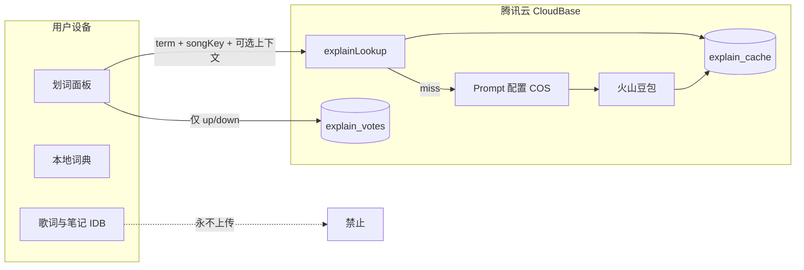

# 自我进化划词架构（MVP）

> 与 [`docs/plan.md`](./plan.md) 同内容镜像；**以 `plan.md` 为准**。

**分支**：`feat/self-evolving-explain-pipeline`  
**原则**：自我进化、越用越聪明、维护成本下降  
**硬约束（产品）**：同一用户**不上传任何自创内容**到云；云端仅接收 **赞 / 踩** 评价，由后台聚合后改共享知识与 Prompt。

关联现状：[`docs/AI_MODE_VOLCENGINE_DESIGN.md`](./AI_MODE_VOLCENGINE_DESIGN.md)

---

## 已确认决策（对话澄清）

| 项 | 结论 |
|----|------|
| 缓存对象 | 共享「歌曲 + 词条」的 AI 讲解 JSON，**不是**用户曲库/笔记 |
| 触发 UX | 仍点「AI讲解」；命中则拉缓存，**不**在打开歌曲时预填 |
| 旁路 | 保留现有 `arkExplainStream` / `arkProxy`；先走 `explainLookup`，未命中再走旧链路 |
| 腾讯控制台 | 计划建 `explain_cache`、`explain_votes`、COS prompts；**尚未创建** |
| MVP 阶段 | A ExplainPayload 适配 → B explainLookup 缓存 → C 赞踩 → D Prompt on COS → E 黄金用例 |
| 编码启动 | 需用户明确确认后再实现 A→C |

---

## 0. 一句话总览

```text
本地：词典 + 用户歌词/学习卡/笔记（永不上传）
云端：共享「热词讲解 JSON」缓存 + Prompt 配置 + 赞踩计数
豆包：只在缓存未命中时，由云函数按统一 Schema 生成
```

用户永远不是「内容贡献者」，只是「质量信号源」。

---

## 1. 数据存在哪里？（完整分层）

### 1.1 仅留在设备（不上云）

| 数据 | 存储 | 说明 |
|------|------|------|
| 保存的歌词本 / 海报工程 | IndexedDB `savedLyrics*` | 含正文 HTML、划词笔记 |
| 学习卡 | IndexedDB `japanese-kana-app-study-cards` | 用户从本机导入/导出备份 |
| 划词本地词典结果 | 内存 / 临时状态 | JMdict / KRDICT / Garu |
| 本机讲解缓存（可选 MVP） | IndexedDB 新表 `explain-cache` | **只读副本**（从云拉取的共享 JSON），非用户创作 |

**铁律**：歌词全文、用户改写的释义、笔记正文、学习卡备份 **禁止** 作为「用户生成内容」上传到云。

### 1.2 云端（腾讯云 CloudBase / COS）— 共享知识，非用户内容

| 数据 | 建议落点 | 谁写入 | 性质 |
|------|----------|--------|------|
| 统一讲解 JSON（按 cacheKey） | 云开发数据库 `explain_cache` 和/或 COS `explain/{key}.json` | **仅云函数**（豆包生成后） | 全球共享只读知识 |
| Prompt / Schema 配置 | COS 或静态托管 `config/prompt_vX.json` | 运营 / 你 | 配置，非用户数据 |
| 赞踩计数 | 云开发数据库 `explain_votes` | 云函数（客户端只报 vote） | 聚合信号，无正文 |
| 豆包 API Key | 云函数环境变量 | 你 | 密钥 |

### 1.3 什么会「越用越聪明」

不是上传用户笔记，而是：

1. 热门 `cacheKey` 被生成一次 → 万人命中缓存（成本↓、速度↑）
2. 踩的比例过高 → 后台作废缓存 → 按新 Prompt 重生
3. 你根据踩的字段分布改 Prompt / 补黄金用例（人工或半自动）

---

## 2. cacheKey 与「同一首歌同一个词」

```text
explain:{schemaVer}:{promptVer}:{lang}:{songKey}:{termKey}:{mode}
```

| 段 | 含义 |
|----|------|
| `schemaVer` | 返回 JSON 契约版本，如 `1` |
| `promptVer` | 生成所用 Prompt 版本，如 `1.2.0` |
| `lang` | `jp` / `ko` / `en` / `zh` |
| `songKey` | `hash(normalize(title)+'|'+normalize(artist))`，**不传原文歌名到日志亦可** |
| `termKey` | `normalize(划选表面形)` |
| `mode` | `deep`（主讲解）或 `lesson:{capsuleTerm}`（次流程胶囊） |

**故意不进 key**：前后句全文（否则几乎永不命中）。  
生成时仍可用前后句；命中缓存时直接展示共享 JSON。

---

## 3. JSON-First：统一 Schema（语种无关 UI）

客户端**只渲染**下列结构（字段名固定；未知字段忽略 → App Store 老包不崩）：

```json
{
  "schemaVersion": 1,
  "promptVersion": "1.2.0",
  "lang": "ko",
  "cacheKey": "explain:1:1.2.0:ko:…:deep",
  "contextSense": "…",
  "formula": [{ "surface": "건", "label": "것은缩略" }],
  "grammar": "…含对比防坑…",
  "capsules": [{ "exam": "TOPIK", "term": "건", "title": "…" }],
  "mood": "…",
  "slang": "—",
  "lesson": null
}
```

次流程（点胶囊）可复用同一壳，或填 `lesson: { meaning, usage, emotion, example }`。

- **日/韩/英/中**：同一 Schema；差异只在 Prompt 变量与本地词典插件。
- **新语种**：加配置行 + Prompt 变量；视图代码目标为 0 改（本地词典可后续再加）。

MVP 过渡：云函数可先「豆包输出 JSON」；客户端暂用适配器把旧散文解析结果也转成该类型，UI 一次切换。

---

## 4. 后台如何维护 Prompt 与数据

### 4.1 Prompt Ops（你日常改的地方）

```text
COS（或云存储）
  config/
    explain_prompt_manifest.json   ← 当前推荐 promptVersion / schemaVersion
    prompts/
      deep_v1.2.0.json             ← 主流程 Master Prompt + 分语种变量
      lesson_v1.2.0.json           ← 次流程微型讲义 Prompt
    schemas/
      explain_payload_v1.json      ← JSON Schema
```

**发布流程（人工，MVP）**

1. 改 Prompt 文件 → 升 `promptVersion`（semver）
2. 跑黄金回归脚本（本地 / CI）
3. 更新 `explain_prompt_manifest.json` 指针
4. App 启动静默拉 manifest；失败则用 **包内 fallback Prompt**

云函数生成时：**以服务端读到的 Prompt 为准**（不要信客户端塞的长 Prompt），避免旧包污染新缓存键。

### 4.2 共享讲解数据维护

| 操作 | 方式 |
|------|------|
| 查看热词 / 踩多的条目 | CloudBase 控制台查 `explain_votes` + `explain_cache` |
| 作废错误缓存 | 删文档或设 `status: stale`（踩阈值触发也可自动） |
| 重生 | 下次请求 miss → 用当前 Prompt 再调豆包 |
| 人工订正 | MVP：**运营在控制台改 JSON 字段**（仍不是用户上传）；后期再做简易 Admin |

### 4.3 赞踩如何进后台

客户端只发：

```json
{ "cacheKey": "explain:…", "vote": "up" | "down", "clientSchema": 1 }
```

**禁止**附带：歌词、用户改写文本、截图 OCR 文本、笔记。

云函数：

- 对 `explain_votes` 做 `up++` / `down++`（可按日聚合防刷）
- 可选：匿名 `installId`（UUID 存本地）做「每 key 每设备每日一票」
- **不**存 Apple ID / 手机号 / 昵称

当 `down / (up+down) > 阈值` 且票数 ≥ N → 标记 cache `stale`。

---

## 5. 请求路由（成本与速度）

```text
划选
  → 本地词典（现有，立刻出）
  → 用户点「AI讲解」
       → GET/POST explainLookup(cacheKey)
            ├─ HIT 共享 JSON → 流式可模拟或直接整包渲染
            └─ MISS → 云函数用服务端 Prompt 调豆包
                      → JSON Schema 校验
                      → 写入 explain_cache
                      → 返回客户端
  → 用户 👍/👎 → voteOnly(cacheKey, up|down)
```

同 key 并发：云函数侧 **单飞**（一人生成，余人等结果），避免万人同时 miss。

---

## 6. 苹果审核（App Store）相关

### 6.1 相对友好的设计点（本方案）

| 点 | 说明 |
|----|------|
| 无 UGC 上传 | 不提供「用户发布讲解/改词到公网」→ 大幅降低 UGC 审核负担 |
| 赞踩是交互反馈 | 类似应用内评分信号，不构成用户生成内容社区 |
| 歌词留本地 | 不把用户曲库同步到你们服务器 |
| AI 披露 | 建议在设置/首次划词说明「讲解由 AI 生成，可能不准确」+ 提供赞踩 |
| 账号 | 继续 CloudBase **匿名登录**即可（现有）；无需强制 Apple 登录，除非以后做跨设备同步用户库 |

### 6.2 仍需注意

| 风险 | 建议 |
|------|------|
| AI 生成内容合规 | 隐私政策写明：会把「划选片段 + 歌名/歌手哈希上下文」发往云端以生成讲解；**不**上传整本歌词库 |
| 缓存是「第三方歌词讲解」 | 讲解为学习辅助 fair use 取向；勿做成歌词全文分发 CDN |
| 未成年人 | 若定位通用 App，隐私政策与 AI 说明保持清晰 |
| 付费/订阅 | 若日后对 AI 收费，走 IAP；与本 MVP 无关 |
| ATT / 追踪 | 赞踩若只用于改进讲解质量、不做跨 App 广告追踪，通常不触发 ATT；勿接广告 ID |

### 6.3 审核话术（预置）

> 本应用的歌词与学习笔记仅保存在用户设备。云端仅缓存「热门词条的结构化语法讲解」（由服务端 AI 生成），并收集匿名的赞/踩以改进讲解质量。用户无法上传或公开发布自定义内容。

---

## 7. 与现有架构的关系（最小修改）

| 现有 | MVP 改动 |
|------|----------|
| `buildMicroscopePrompt.ts` 客户端拼 Prompt | 逐步改为「云函数读配置」；客户端保留 fallback |
| 散文 `【标题】` 解析 | 新增 JSON Schema；适配器兼容旧输出一个版本 |
| `arkExplainStream` / `arkProxy` | 旁路新增 `explainLookup` + `explainVote`；旧链路可暂留 |
| 本地词典 | **不动** |
| 学习卡 / 歌词 IDB | **不动、不上云** |
| 面板 UI | 先继续吃同一字段；底层数据源改为 JSON |

---

## 8. 最小化修改的 MVP 路径（推荐顺序）

原则：**先旁路、后替换；先缓存与赞踩，再 Prompt 热更新；不接用户内容。**

### Phase A — 契约与兼容（客户端，小改）

1. 新增 `ExplainPayload` TS 类型 + JSON Schema 文件（仓库内）。
2. `parseAiExplainParts` 结果 **映射** 为 `ExplainPayload`（不改 UI）。
3. 面板仍用现有组件，只是数据来自统一类型。

**验收**：产品表现与现在一致。

### Phase B — 共享缓存查找（云函数，核心 ROI）

1. 新云函数 `explainLookup`：
   - 入参：`lang, title, artist, term, mode`（及可选前后句，**仅 miss 时用于生成**）
   - 算 `cacheKey` → 读 `explain_cache`
   - HIT：返回 JSON
   - MISS：用**函数内嵌 Prompt v1**（暂不热更新）调豆包 → 校验 → 写入 → 返回
2. 客户端：`requestAiDeepDive` 优先调 `explainLookup`；失败再降级现有 stream/proxy。

**验收**：同一首歌同一词第二次起明显加速；豆包调用次数下降。

### Phase C — 仅赞踩（无内容上传）

1. UI：讲解卡片底部 👍 / 👎（可选「踩的原因」用**枚举**：不准确 / 串语种 / 其他 — **仍不是自由文本**，或干脆不要原因）。
2. 云函数 `explainVote`：只收 `cacheKey + vote`。
3. 控制台可看 top-down keys；手动 stale；或自动阈值作废。

**验收**：踩多的词下次会重生；库中无任何用户歌词/笔记。

### Phase D — Prompt 配置外置（运维减负）

1. Prompt 放到 COS + manifest。
2. 云函数生成前拉 Prompt；App 也可拉作展示/调试。
3. 升 `promptVersion` → 自然形成新 cacheKey 命名空间（旧缓存可保留或批量过期）。

### Phase E — 黄金回归（防改 Prompt 翻车）

1. 30 条固定用例（日韩英中 + 串台反例）。
2. 脚本：跑 lookup 生成或读 fixture → Schema + 断言。
3. 改 Prompt 必跑。

---

## 9. MVP 明确不做

- 用户上传修正文案 / 笔记同步 / 学习卡云同步  
- 自由文本「报错说明」进云（易变 UGC）  
- 完整全球 CDN（先 DB/COS 即可）  
- 用踩直接自动覆盖为用户认为的正确答案  
- 越南/泰语等新语种本地词典（可先只开 AI+配置）

---

## 10. 隐私与数据流示意



---

## 11. 成功指标（MVP）

| 指标 | 目标感 |
|------|--------|
| 热词缓存命中率 | 上线两周后热门曲 > 50% |
| 同词重复点击延迟 | HIT < 300ms（网络内） |
| 豆包调用量 | 相对无缓存显著下降 |
| 云端用户内容 | **恒为 0**（无歌词/笔记/改写） |
| App 审核 | 无 UGC 社区；AI 说明清晰 |

---

## 12. 下一步实现建议

1. 本分支落地 Phase A 类型与适配器（零产品变化）。  
2. 实现 `explainLookup` + `explain_cache`（Phase B）。  
3. 加赞踩 UI + `explainVote`（Phase C）。  

确认后按 A → B → C 提交小 PR，避免一次大爆炸改动。
